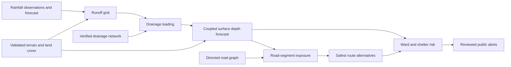

# Backend implementation status

Status reviewed on 13 September 2026. A passing unit test proves the behavior
named by that test; it does not make the underlying model operationally
validated.

## Current services

| Area | Implementation and endpoints | Persistence | Data status | Readiness |
|---|---|---|---|---|
| Risk and point forecast | `backend/routers/risk.py`; `/api/v1/risk/current`, `/risk/forecast`, `/risk/explain`, historical scenario endpoints | Risk logs use PostGIS when configured | Weather can be live Open-Meteo; terrain and drainage may fall back or be unavailable | Prototype |
| Weather | `backend/routers/weather.py`, `backend/services/weather_service.py`; current and hourly forecast endpoints | In-process TTL cache | Open-Meteo/OpenWeatherMap with explicitly marked mock fallback | Demo-ready, not operational radar |
| Rainfall grid | `rainfall_grid.py`, `rainfall_pipeline.py`; invoked by surface/forecast endpoints | Forecast runs use PostGIS plus assets, or explicit development SQLite fallback | Supplied/replay frames input; no Mumbai radar ingestion adapter yet | Prototype |
| Drainage | drainage router plus graph, topology, capacity, municipal import/model and simulation services | Request payload and audited files; database schema now exists for imported assets | Public municipal extract; hydraulic survey fields and confirmed outfalls are incomplete | Topology prototype |
| Surface/coupled model | surface router plus `surface_routing.py` and `coupled_simulation.py` | Results can be saved as forecast runs | Small deterministic model; not calibrated for operational depth claims | Prototype |
| Saved forecasts | `/api/v1/forecasts`, depth, GeoJSON and drainage layers | PostGIS metadata with versioned file assets; SQLite only in non-production fallback mode | Model output | Development-ready |
| Safe routing | safe-route GET/POST in risk router and `osm_road_router.py` | No durable road/exposure cache yet | Road-following OSRM/OSM geometry; flood assessment is unavailable unless validated forecast coverage exists | Road routing works; forecast constraint incomplete |
| Data readiness | `/api/v1/data/readiness`, `/api/v1/readiness` | File and dependency inspection | Reports missing validated inputs rather than inventing values | Implemented foundation |
| Citizen, shelters, alerts, admin auth | Documented product contracts only | Schema foundation only | No operational service | Pending |

## Dependency chain

## Persistence foundation

The SQLAlchemy/PostGIS schema covers cities, wards, terrain datasets, drainage
assets, roads, rainfall frames, forecast runs/layers, road and route
assessments, reports, shelters, alerts, model versions and audit events.
Alembic owns schema creation. Production refuses an unconfigured database and
does not permit the SQLite forecast fallback. Large forecast results are stored
as files under the configured asset root; the database stores their metadata.

Live PostGIS integration tests are opt-in with `RUN_POSTGIS_TESTS=1` and must
point at an isolated disposable test database. This prevents tests from dropping
tables in a developer or production database.

## External blockers

1. Validated high-resolution bare-earth DTM, vertical datum and checkpoints.
2. Complete municipal drainage shapes, invert levels, sections, roughness,
   asset status and confirmed outfalls.
3. Licensed/approved Mumbai radar or DWR rainfall access and a repeatable event
   bundle.
4. Independent observed rainfall, depth and road-closure data for calibration
   and held-out validation.

## Recommended implementation order

1. Finish database migration validation against an isolated PostGIS instance.
2. Add provider-based live rainfall ingestion with freshness and fallback state.
3. Complete terrain/runoff preprocessing and drainage import quality gates.
4. Scale and benchmark the coupled forecast model.
5. Publish tile-friendly forecast and road-exposure products.
6. Constrain route costs with the selected forecast layer.
7. Add historical validation, then citizen, shelter, alert and admin services.
8. Add authentication, workers, observability, deployment and release gates.

## Test baseline

The 13 September 2026 baseline is 163 passing and 4 skipped Python tests. The
skipped tests require an explicitly enabled isolated PostGIS database. Frontend
map and gesture tests pass 15 of 15 after the local 3 km map-view update.
